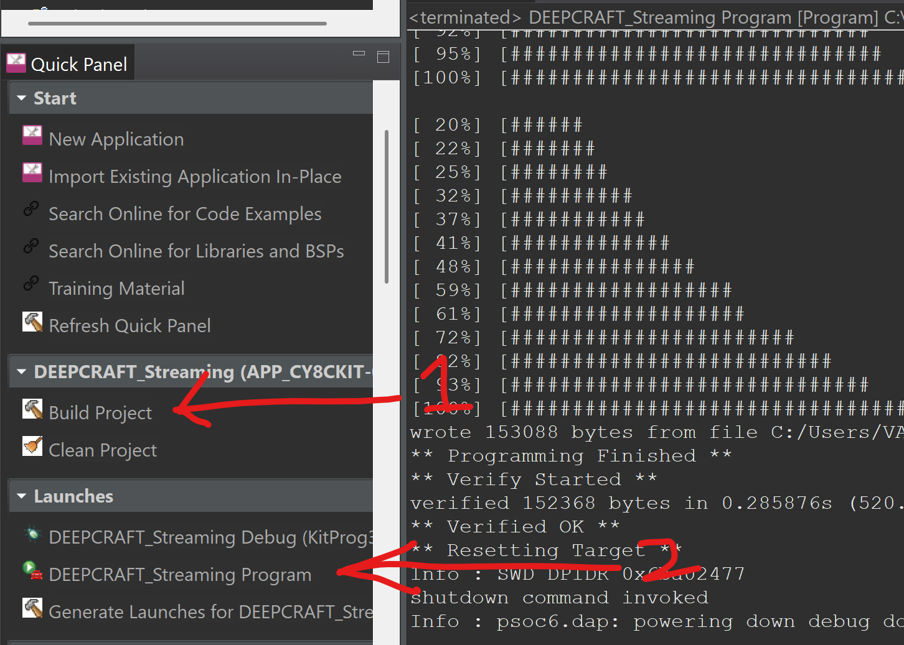

# Illegal-Logging-Detector-Infineon


# Introduction:

Avoid illegal logging in protected areas.

We can find that just in Mexico (my home country) [1] 70 percent of the wood consumed is of illegal origin according to a study carried out by one of the most prestigious universities UNAM (QS ranking # 94 - 2025).

https://translate.google.com/translate?sl=es&tl=en&u=https://www.dgcs.unam.mx/boletin/bdboletin/2018_173.html


I’ll  create a system that is capable of recognizing, through Machine Learning the sounds generated by falling trees, chainsaws and human voices in protected areas, thus warning that illegal logging may be occurring.

I especially want a system that can help protect forests and the species that inhabit them.


Most solutions are based on raising awareness, but looking at more dedicated solutions we can find:

- TreeTAG is an emerging smartphone-based supply chain traceability system developed by Earth Observation Systems that tracks the location of logs transported from the forest to the mill.

- Disadvantages: Very complex system that requires authorized personnel to be manipulated.

- Stardust is a dust-like material that can be sprayed onto wood and detected only with a hand-held device. 

- Disadvantages: You need to tag manually every tree which is labor intensive and expensive.

# Solution:

The system, will be easily reproducible, energy efficient and powerful thanks to the ML algorithms that will be implemented and trained with the cloud services that we will use for deployment.


With the CY8CKIT-062S2-AI i will obtain an audio signal which, through DEEPCRAFT™ Model, we can pass through a neural network. That will tell us if the noise of a saw cutting the trees or human voice in the forest.

# System:


### Features:

* Low-power battery consumption (CY8CKIT-062S2-AI).
* High accuracy (Thanks to DEEPCRAFT™).
* Easy production at large scale, due to its simplicity.

### Hardware:

* CY8CKIT-062S2-AI. 1x.
  * https://www.infineon.com/cms/en/product/evaluation-boards/cy8ckit-062s2-ai/
* RGB Led 1x. 
  * https://www.amazon.com/Tri-Color-Multicolor-Difundido-Resistencias-Incluido/dp/B077XGF3YR/?th=1
* 100 Ohms Resistor 3x. 
  * https://www.amazon.com/EDGELEC-resistencias-tolerancia-m%C3%BAltiples-resistencia/dp/B07QG1VL1Q
* Buzzer 1x. 
  * https://www.amazon.com/DC-electr%C3%B3nico-zumbador-vivienda-conector/dp/B0DHRMYHQ2

### Software:

* DEEPCRAFT™.
  * https://www.imagimob.com/
* ModusToolbox™.
  * https://www.infineon.com/cms/en/design-support/tools/sdk/modustoolbox-software/
* Audacity.
  * https://www.audacityteam.org/

# Capturing Data:

The quality of an AI model depends greatly on the data with which it is trained; in my case I am looking for 3 main detections.

- Chainsaw: Detect if there is chainsaw noise indicating that a tree is about to be cut.
- People: The detection of human voice, to detect human presence near the area.
- Forest: This would be the noise of a forest; this would be the base state of the system since in the forest there is rarely absolute silence.

Now I will explain a bit about the data details and the reason for the distribution.

| Category  | Number of DataFrames | Duration per DataFrame |
|-----------|---------------------|------------------------|
| Chainsaw  | 13                  | 1 min each            |
| Forest    | 13                  | 1 min each            |
| People    | 13                  | 1 min each            |

This distribution of 13 audio files, each with a duration of 1 minute, is intended to make it easier for DEEPCRAFT™ to split and train the model with the data.


All these data were trimmed in Audacity to facilitate audio manipulation; in addition, this program allows us to convert the audio to Mono and ensure that it is at 16kHz, like the microphone input on the board.

All the dataframes are at the following link: [CLICK HERE](./Illegal%20Logging%20Detector%20Model/Data/)

# DEEPCRAFT™:

### Labeling:

As mentioned in the previous point, the databases are distributed so that DEEPCRAFT™ can identify each of the dataframes as different segments.


The prediction labels that we will identify in all these audios will be the ones described earlier.


### Distribute:

Once the labeling of all the audios is done, you can manually select where each of the sets goes, Train, Test or Validation. However, since we created uniform segments, we can do the automatic distribution with the program.


### Preprocessor:

If all the previous steps are correct, we can move on to the Preprocessor section; this section is extremely important to create the model because we will have to add some additional components so that the model works correctly on the board.


- Imagimob Speech Features: This component will perform a preprocessing of the signal in order to obtain only the relevant features for the model; although for our project a range of 300Hz - 8000Hz is sufficient, we recommend performing a spectrogram analysis of your audios to be sure you do not lose important features.


- Contextual Window (Sliding Window): This preprocessing layer allows us to perform the windowing technique to process the data in the neural network; this strategy is widely used in models dedicated to IoT and moreover the model will not allow compilation if we do not use it.


### Model Selection:

Because we are going to run the model on a small board, it is best to try to make the AI models as small as possible; although I used the following configuration, you can experiment with other configurations.


### Model Validation:

Once the training of the AI model was done, we obtained the following results.


We reviewed this model directly in the program to see that it is giving the correct results.


Finally, the results to perform the detection of human voice were correct.


### Generate Code:

Just with the .h5 file it is not enough to already deploy the model on our board; for this we will have to convert the neural network into the files model.c and model.h in the correct format so that it can run on the board, so you will have to configure the following parameters and generate the code.


# ModusToolbox™

Finally, with the model.c and model.h files, we will be able to deploy it on our device through the Modus project.


### Deploy Model:

We recommend copying the project inside this repository to avoid compatibility problems; finally only the build of the project would be left and to program our board.



If you did all the previous steps correctly, you should see the results of the model directly in the terminal.


We obtain this result by placing a Chainsaw simulator next to the device, showing that it is correctly detecting the chainsaw.


Subsequently, to have an output signal once it is placed on a tree, we set up an RGB LED configuration in order to visualize the results in real time.

```c
else if(best_label != 0 && max_score >= 0.50)
{
  prev_best_label = best_label;
  printf("Output: %-30s\r\n", label_text[best_label]);
  if(label_text[best_label]=="Chainsaw"){
    turnOnRed();
    turnOnBuzzer();
  }
  else if(label_text[best_label]=="Human"){
    turnOnBlue();
    turnOffBuzzer();
  }
  else if(label_text[best_label]=="Standby" || label_text[best_label]=="unlabelled"){
    turnOnGreen();
    turnOffBuzzer();
  }
}


The circuit looks like this; it is very simple but the resistor values are important for proper operation.


# Final Product:

Case Closed:


Case open:


